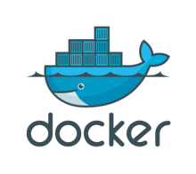

#### [devops-novice](../README.md)

---

# Docker

---

## Introduction
Docker is containerization technology which uses the Linux Kernel features to create containers on top of an operating system and automates application deployment on the container. Containers can be thought of as extremely lightweight, modular virtual machines.

---

### Docker Installation

#### Uninstall older Docker if any

`sudo apt-get remove docker docker-engine docker.io containerd runc docker*`

#### Set up the repository

#### Installing required packages

`sudo apt-get update`

`sudo apt-get -y install
    apt-transport-https
    ca-certificates
    curl
    gnupg-agent
    software-properties-common`

---		

#### Add Docker's official GPG Key

`curl -fsSL https://download.docker.com/linux/ubuntu/gpg | sudo apt-key add -`

#### Verify key

`sudo apt-key fingerprint 0EBFCD88`

---

#### Setup stable repository

`sudo add-apt-repository
   "deb [arch=amd64] https://download.docker.com/linux/ubuntu
   $(lsb_release -cs)
   stable"`

#### Install Docker Engine and docker-compose

`sudo apt-get update`

`sudo apt-get install -y docker-ce docker-ce-cli containerd.io docker-compose`

---

#### Add current user to docker group

`sudo usermod -aG docker $USER`

Log in and logout current user to avoid using docker commands with `sudo`

---

#### Start docker service

`sudo systemctl enable docker`

`sudo systemctl start docker`

---

#### Verify docker Installation

`sudo docker run hello-world`

---

#### Install Docker with a single script

[install_docker.sh](https://github.com/rahulrdate/devops-novice/blob/master/docker/install_docker.sh)

---

Next: [Docker Cheatsheet](docker-cheat-sheet.md)

---

_[Docker](https://www.docker.com/)_

#### [devops-novice](../README.md)
